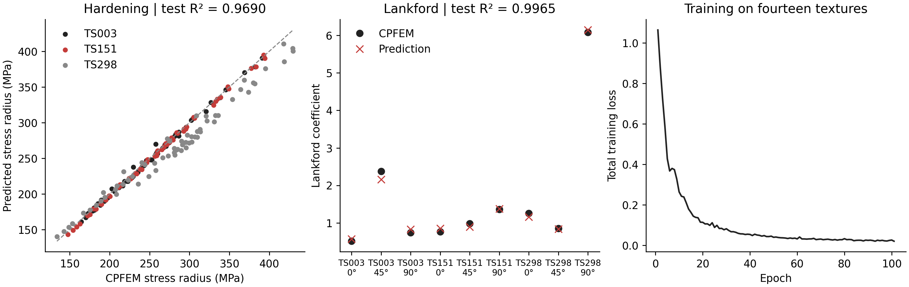

# Bundled example results

Fresh training on fourteen textures; three validation textures select the checkpoint; three separate test textures are evaluated afterward. This small example demonstrates the software workflow and does not reproduce the full-database paper metrics.

Seed: 7. Completed epochs: 101. Selected epoch: 76 (raw).

| Response | Test R² | Mean absolute error |
|---|---:|---:|
| Hardening | 0.969013 | 7.148933 MPa |
| Lankford coefficients | 0.996459 | 0.081138 |

R² is pooled over the three test RVEs and their supplied response coordinates. This sample is too small to establish generalization performance.

| Condition | Tensile angle (°) | CPFEM r | Predicted r | Difference |
|---|---:|---:|---:|---:|
| TS003 | 0 | 0.515706 | 0.573584 | +0.057878 |
| TS003 | 45 | 2.374840 | 2.162950 | -0.211891 |
| TS003 | 90 | 0.747028 | 0.834578 | +0.087550 |
| TS151 | 0 | 0.765107 | 0.860442 | +0.095335 |
| TS151 | 45 | 0.983679 | 0.896214 | -0.087465 |
| TS151 | 90 | 1.367569 | 1.381528 | +0.013959 |
| TS298 | 0 | 1.259094 | 1.164454 | -0.094639 |
| TS298 | 45 | 0.858153 | 0.839861 | -0.018293 |
| TS298 | 90 | 6.078459 | 6.141686 | +0.063228 |

